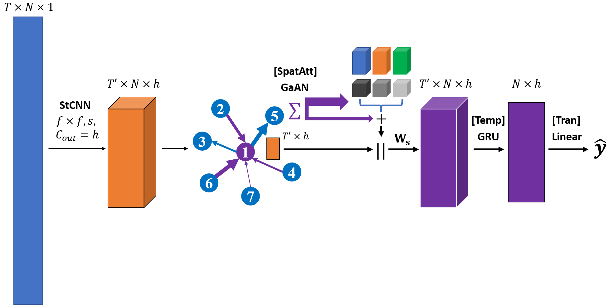
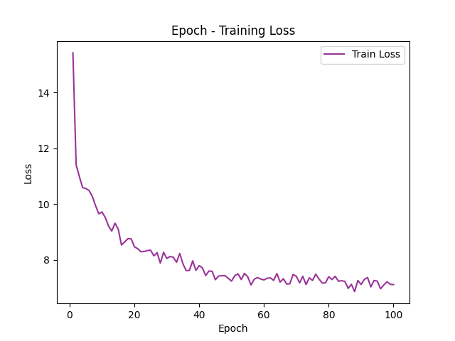
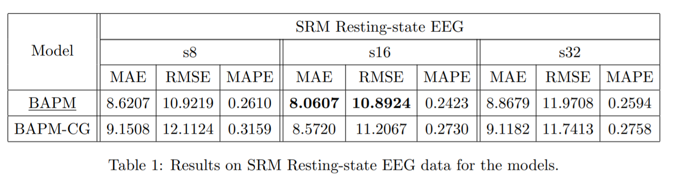
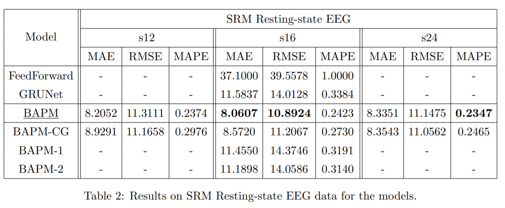
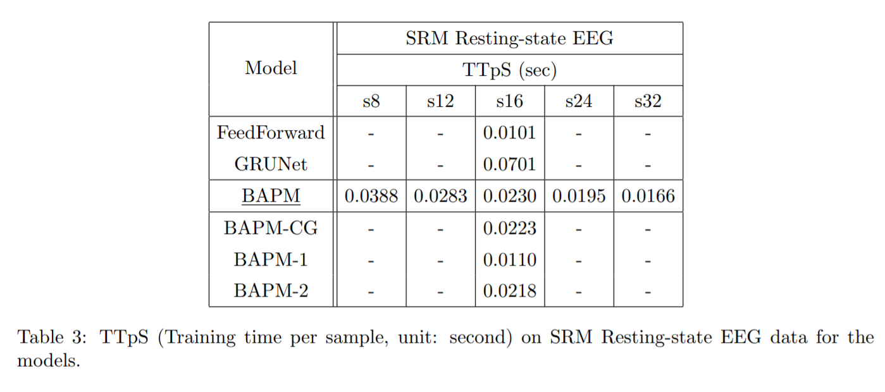
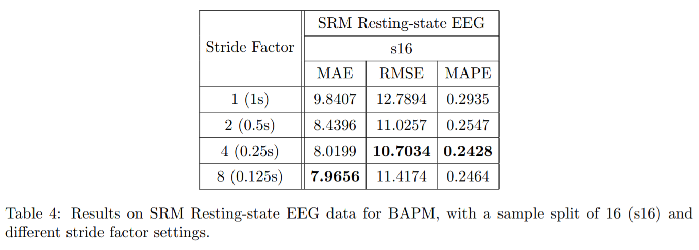
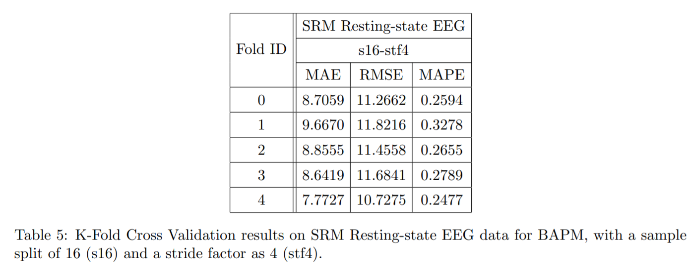

# EEG2Age
Human Brain Age Prediction based on EEG Signals

<br>

## Introduction

This is a project from a course BME5012 - Brain Intelligence & Machine Intelligence (2021 Fall), in SUSTech. The project aims to study several deep neural network designs to predict the human brain age according to the given EEG brain signals. Currently, the common approach is to train certain model using the chronological age of healthy human as the label. Then, the model can be used to analyze the "brain age" of a patient so as to discover whether there is any functional disorder occurring.

<br>

## Data

This EEG dataset contains [resting-state EEG](https://openneuro.org/datasets/ds003775/versions/1.0.0) extracted from the experimental paradigm used in the Stimulus-Selective Response Modulation (SRM) project at the Dept. of Psychology, University of Oslo, Norway.

The data is recorded with a BioSemi ActiveTwo system, using 64 electrodes following the positional scheme of the extended 10-20 system (10-10). Each datafile comprises four minutes of uninterrupted EEG acquired while the subjects were resting with their eyes closed. The dataset includes EEG from 111 healthy control subjects (the "t1" session), of which a number underwent an additional EEG recording at a later date (the "t2" session). Thus, some subjects have one associated EEG file, whereas others have two. In this project, we choose the “t1” session of all EEG file.

<br>

## Model

### Our Model - BAPM



**Brain Age Prediction Model (BAPM)** is a model composed of four layers, namely:

1.   **StCNN (Short-term temporal convolutional layer)**: a 1-dimensional convolutional layer which aggregates groups of timestamps along the time dimension. It aims to extracts short-term patterns from the preprocessed EEG signals. Meanwhile, the layer effectively reduces the data size during the training process.
2.    **Spatial Attention Layer**: This layer includes a multi-head [GaAN](https://arxiv.org/pdf/1803.07294.pdf) (Gated Attention Network) module which aggregates information among the channels (electrodes) using a pre-calculated graph (using Pearson Correlation Coefficient).
3.   **Temporal Layer**: This layer is simply a GRU to run through all the reduced “timestamps” and aggregate the temporal features. The output will be a fully aggregated spatial-temporal embedding feature tensor.
4.   **Transfer Layer**: This layer uses two fully-connected sublayers (and ReLU as the activation function) to first aggregate the information along the channel dimension, then aggregate the features along the feature dimension. The final output will be the prediction age value.

<br>

### Baseline & Other Models

#### FeedForward

We use a simple feed-forward neural network which contains only two linear layers as the baseline model.

The structure for the baseline model can be summarized as follows:
```text
[Linear(in_features=in_dim, out_features=hidden_dim, bias=True),
Linear(in_features=hidden_dim, out_features=out_dim, bias=True)];
```
where `out_dim = 1`.

#### GRUNet

The comparison model uses a linear layer to aggregate the spatial features along the channel dimension, and then a GRU to aggregate the temporal features along the time dimension. To compare with our model - BAPM, it does not use graph convolution for spatial feature extraction.

<br>

### Variants

#### BAPM-CG

BAPM-CG (BAPM - Customized Graph) uses a customized graph specified by our group member which manually groups channels from the same defined “brain regions”. Instead of calculating the Pearson Correlation Coefficient values among the channels, the channels in the same brain region form up connections while no connections are formed across different brain regions.

#### BAPM-X for Ablation Experiment

For ablation experiment, two extra variant models which remove certain modules from BAPM are tested:

-   **BAPM-1: StCNN + Linear**, only the short-term temporal convolution layer is used.
-   **BAPM-2: StCNN + Spatial + Linear**, GRU is replaced by a simple fully-connected layer for temporal feature extraction.

<br>

## Experiment

### Settings

For metrics, we use MAE (Mean Absolute Error), RMSE (Rooted Mean Squared Error) and MAPE (Mean Absolute Percentage Error) to evaluate the model performance. The equations of metrics are listed as follow ( is the ground truth label and  is the prediction result): 

%20=%20\frac{1}{z}\sum_{i=1}^{z}|y%20-%20\hat{y}|)

%20=%20\sqrt{\frac{1}{z}\sum_{i=1}^{z}(y%20-%20\hat{y})^2})

%20=%20\frac{1}{z}\sum_{i=1}^{z}|\frac{y%20-%20\hat{y}}{y%20%2B%20\epsilon}|)

 is a small addictive value to prevent the denominator from being zero.

The preprocessed EEG data contains 245760 timestamps (240s). The frequency is 1024 Hz and the number of electrodes is 63. The data includes 111 subjects, 11 of which are removed. The data of each subject is further split uniformly into multiple samples (s8 specifies that one subject is split into 8 samples, and the total number of timestamps for each sample is 245760 / 8 = 30720, which is 30s). For the train-validation-test split, we first shuffle the samples and select the last 20% as the test data. Then the rest of the data is split into 5 pieces. The validation set takes one of them and the rest goes to the training set.

The implementation uses [PyTorch](https://pytorch.org/) and [DGL](https://www.dgl.ai/) and the experiments are run on *Tesla P100-PCIE-16GB*. The learning rate, total training epochs, batch size, hidden dimension, number of attention heads are specified as 0.01, 100, 5, 5 and 3 respectively. The selected optimizer is Adam and the loss function is SmoothL1Loss which is more resistant to noises than MSELoss. For StCNN, several stride values are tested (a stride factor - `stf` is specified, meaning to run over `1/stf` seconds each time. E.g., `stf4` specifies a stride value of 1024 / 4 = 256, which is 0.25s).

We also perform K-Fold Cross Validation (5 folds) on our model (BAPM) with settings as `s16-stf4`.

<br>

### Results

The training loss curve of BAPM on the dataset with `s16-stf4` settings is shown below:



The training loss rapidly descends in the first 5 epochs. Then, it steadily goes down until about 60 epochs. Afterwards, the model seems to converge and fluctuate around 7.5.

The metrics results are shown in Table 1 and 2. From the two tables, BAPM outperforms the two comparison baseline models on all three metrics. BAPM-CG performs slightly worse than BAPM, indicating that our customized graph design may be inadequate to show the true relationships among the electrodes. The results of BAPM-1 and BAPM-2 prove the importance of performing both spatial and temporal feature extractions. When we gradually add back the modules, the results improve step by step. The performance largely increases as soon as both spatial and temporal feature extraction layers are recovered.

For BAPM, the best MAE value 8 indicates the age prediction error. This result is, however, not the best value (which is around 4). The reason might be that the data is not enough for the model to fully discover certain pattern (overfitting is obvious in a `s4` setting).

It can also be discovered that the results vary as the number of samples split from one subject increases. For MAE and RMSE, a sample split of 16 gives the best results while for MAPE, a sample split of 24 gives the best results. This is explainable, since as the sample split increases, the total number of samples increases, enabling the model to converge more stably without overfitting. On the other hand, the number of timestamps for each sample decreases, which might break certain pattern along the time dimension when the sample is too short. Considering that MAE is the most important metric we care about, we select `s16` as the best and default setting.

<table>
    <tr>
        <td>
            
        </td>
        <td>
            
        </td>
    </tr>
</table>

The TTpS (Training time per second) results are shown in Table 3. It can be discovered that the training time is not significantly longer than a simple feed-forward neural network, since StCNN largely reduces the dimension.



The results using different StCNN stride settings are shown in Table 4. The results are best when the stride factor is 4 (MAE is not much worse than that of `s8`). Theoretically, there should also be a stride factor value between 1 and 1024 which provides the best results. However, our 16GB GPU has been overloaded when the value is over 8. As a result, we select `stf4` as the best and default setting.



The results of K-Fold Cross Validation for BAPM with settings as `s16-stf4` are shown in Table 4. It can be discovered that the results obtained by our model are relatively stable. The average values are as follow:

-   MAE = `8.7286`;
-   RMSE = `11.3910`;
-   MAPE = `0.2759`.



<br>